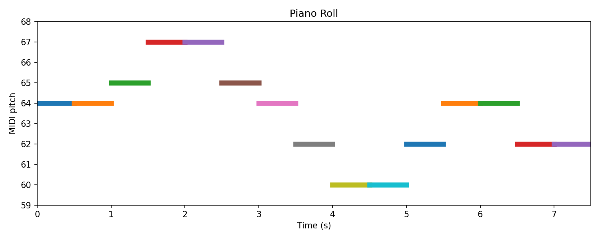
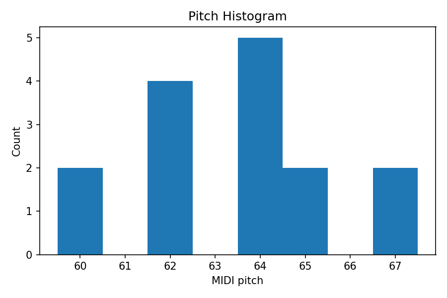

# 🎼 Beethoven AI: Final Symphony

*A groundbreaking project merging Beethoven’s timeless genius with modern AI technology to redefine symphonic composition.*

---

## 🚀 Core Innovations

1. **Expressive Nuance: Computer Vision (CV)**
   - Analyzes Beethoven’s manuscripts and digital scores.
   - Captures phrasing, dynamics, and thematic development.

2. **Dynamic Collaboration: Game Theory**
   - Real-time AI–human co-creation framework.
   - Balances AI-generated ideas with composer decisions.

3. **Stylistic Authenticity: Machine Learning**
   - Deep learning models trained on Beethoven’s repertoire.
   - Preserves harmonic, rhythmic, and structural integrity.

4. **Precision & Scalability: RPA Orchestration**
   - Automates part preparation, rehearsal scheduling, and orchestration logistics.

5. **Mathematical Depth: Algorithmic Rhythms**
   - Recursive algorithms + OOP for rhythmic innovation (syncopation, counterpoint, metric modulation).

---

## 🎹 Visualizations

  
  

  

---

## 📂 Project Structure

